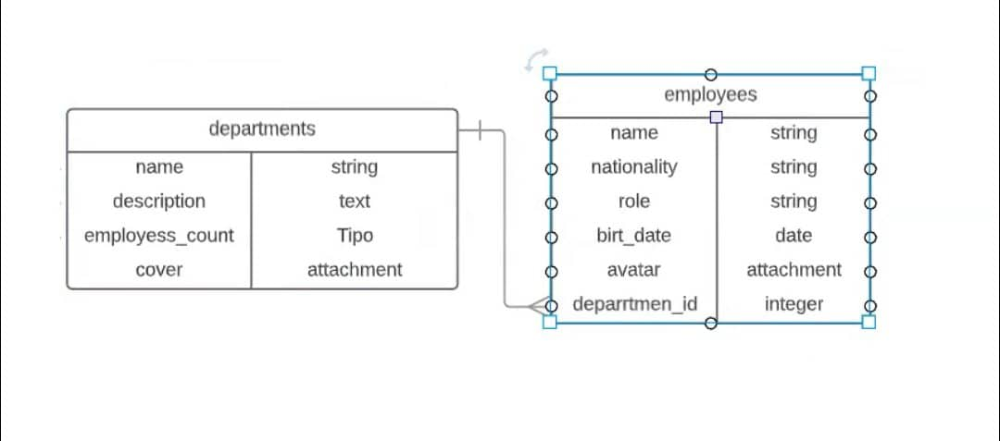

# Offix



- Create Departments model

```bash
rails generate model Deparment name:string:uniq description:text employess_count:integer
```

- Create Employee model

```bash
rails generate model Employee name nationality role birth_date:date  deparment:references
```
